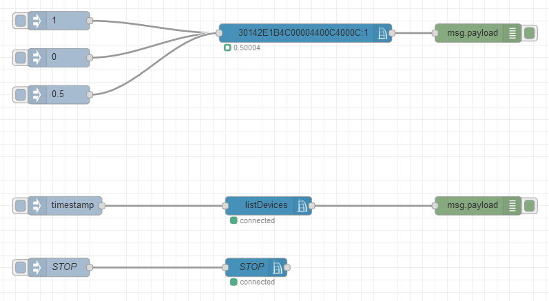
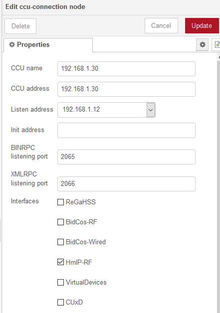
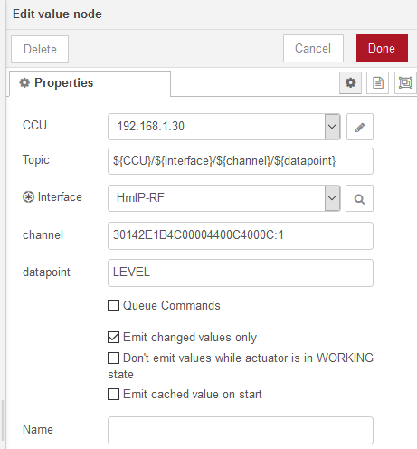

# CCU connection

If not installed yet, install the `node-red-contrib-ccu` node using the `manage pallete` option.

Paste the `flows.json` content into Node-red.

Your flow will look something like:

Open the top right menu and select `Configuration nodes`

Double click the ccu node and a config screen will open:

And enter the following values:

- CCU address = `192.168.1.30`
- Listen address should be the address of the device running node-red.
- Uncheck all devices except `HmIP-RF`
- Select update.

Double click the top blue node. You will be presented a config screen:

Select the proper channel. This will be auto populated when a device is connected. To operate EASE blinds use channel one.
