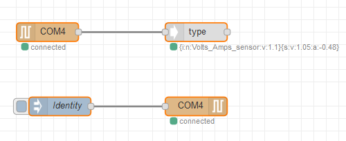

Use this flow to identify a connected squid.

- Connect to a serial port.
- Press button `Identity`.
- Under the `type` node the identity is now displayed.

## Installation

Copy the contents of the `flows.json` file to the clipboard.

In node red select `top right menu` - `import` - `Clipboard`
