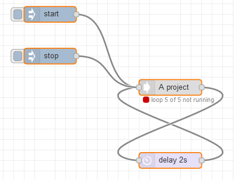

# Project basics

Each projects needs an entrypoint.
This entry point allows for starting a project, providing global data and defining a test loop.

- Define global data double clicking on the `squid data` node
- insert your loop nodes at the outgoing side of the `squid data` node and create a loop by connecting the end of the test to the input of the `squid data`

## Installation

Copy the contents of the `flows.json` file to the clipboard.

In node red select `top right menu` - `import` - `Clipboard`
